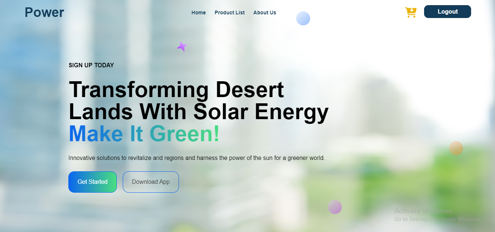

# **Transforming Desert Lands with Solar Energy**

## **Introduction**

This project aims to transform desert areas into sustainable green spaces by harnessing solar energy. It offers a platform that simulates the real-time solar energy potential of various regions, helping users explore how renewable energy can drive environmental restoration.

- **Deployed Site**: [--](#)
- **Final Project Blog**: [LinkedIn Post](https://www.linkedin.com/posts/a-laa-hamed-92a6b9233_renewableenergy-solarenergy-fullstackdevelopment-activity-7243961953688162306-TMg8?utm_source=share&utm_medium=member_desktop)
- **Author**: [Alaa Hamed](https://www.linkedin.com/in/alaa-hamed-92a6b9233)

---

## **Installation**

To set up the project locally:

1. **Clone the repository:**

    ```bash
    git clone https://github.com/alaahamed1/Alx-Backend.git
    ```

2. **Install dependencies:**

    ```bash
    cd project-name
    npm install
    composer install
    ```

3. **Set up the `.env` file** and update the necessary environment variables.
    ```bash
    cp .env.example .env
    php artisan key:generate
    nano .env
    ```

4. **Run the project:**

    ```bash
    php artisan serve
    npm run dev
    ```

5. **For the frontend:**
```bash
    npm run serve
```
---

## **Usage**

This project allows users to explore solar energy potential in various desert regions. It includes:

- Real-time data visualization using solar energy APIs.
- An interactive UI that simulates energy output under different environmental conditions.

Once set up, access the local environment at `http://localhost:8000` for the backend
and `http://localhost:8080` for the frontend.

---

## **Contributing**

Contributions are welcome! Here's how you can contribute:

1. **Fork the repository.**
2. **Create a new branch:**

    ```bash
    git checkout -b feature-branch
    ```

3. **Make your changes and commit them:**

    ```bash
    git commit -m "Description of changes"
    ```

4. **Push the changes:**

    ```bash
    git push origin feature-branch
    ```

5. **Submit a pull request.**

---


## **License**

This project is licensed under the MIT License. See the [LICENSE](./LICENSE) file for more details.

---

## **Technical Details**

This project leverages Vue.js for the frontend due to its reactivity and smooth user experience. For the backend, Laravel was chosen for its robust handling of API integrations and seamless data flow management.

### **Key Challenges**

One of the key challenges was implementing real-time solar energy data simulation. This was achieved by caching API responses in the Laravel backend, improving performance and minimizing delays.

### **Inspiration and Vision**

Growing up in an arid region, I witnessed the environmental challenges faced by local communities. This project represents a step toward addressing those challenges using renewable technology. Future iterations aim to increase simulation accuracy and explore more energy-efficient solutions.

---

## **Screenshots**



